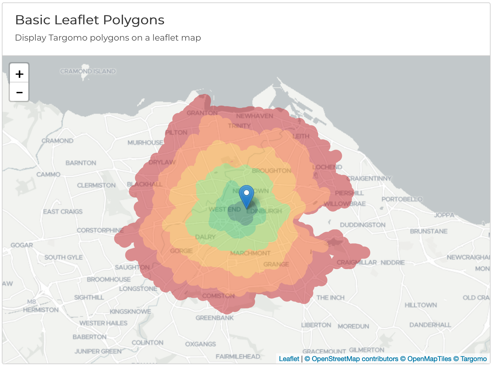
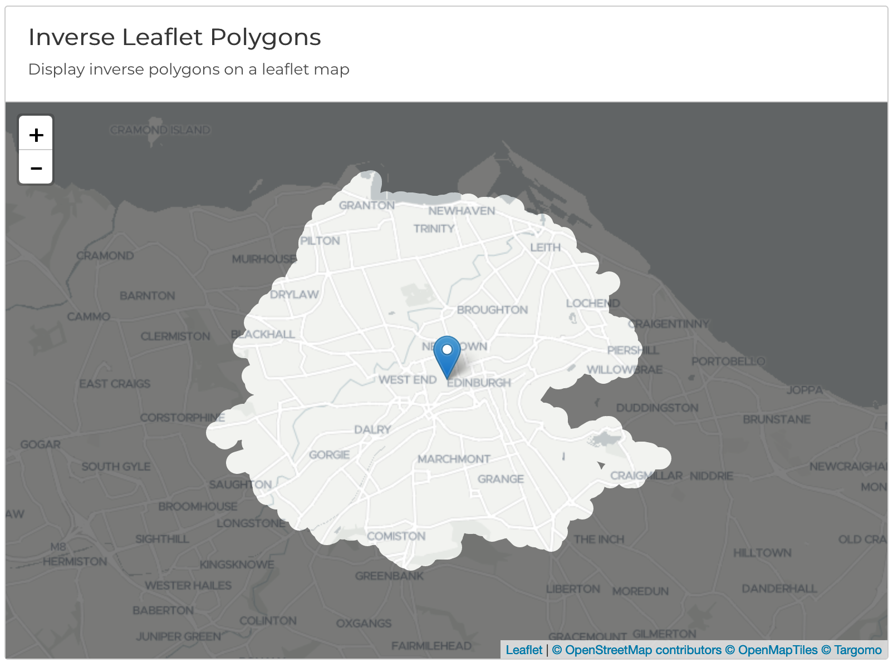

# targomo-js-leaflet
Leaflet extensions for targomo-js

The Targomo Leaflet extensions Typescript library provides extensions for visualising results obtained from the Targomo services. The project is maintained by [Targomo](https://www.targomo.com/). The lib can also be used in non-typescript environments.

## Standard Polygons

## Inverse Polygons


# API Key

[Get your free API key by signing up for a Targomo account](https://account.targomo.com/signup?plan=free)

# Regions

The Targomo API is available in many regions. For all available endpoints, see our [availability map](https://targomo.com/developers/resources/coverage/)

# Getting started

## Usage in TypeScript/ES6 Environments

Install via npm:

```
npm install @targomo/leaflet
```

Example usage for polygon layer

```
  const layer = new tgm.leaflet.TgmLeafletPolygonOverlay()
  layer.addTo(map) // Add to leaflet map

  const polygonData = await targomoClient.polygons.fetch(....) // Fetch polygon data from Targomo service, see @targomo/core lib for more details
  layer.setData(polygonData)  // Visualize received data on layer
}
```


# Docs

More detailed overviews of Targomo's services, along with code examples and demos is available at [https://targomo.com/developers/libraries/javascript/](https://targomo.com/developers/libraries/javascript/).

Reference docs available [here](https://app.targomo.com/tsdocs/).